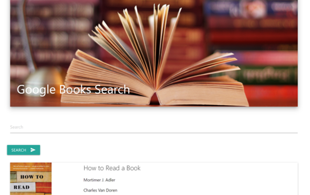

# Google Books Search and Save Application

David Ferro

https://googlelibrarybooksearch.herokuapp.com/

## Description

This is an application where you can quickly and easily search the Google Books Site and get an easy to read description of the books in a more user-friendly format.  If you like what you're reading, feel free to save the book for later.  You also have the option to go straight to the Google Books Site to try to get the whole tome or pamphlet.

This site was developed using React, a component-based, compiled version of JavaScript and HTML that uses a hybrid language called JSX for building the components of the website.  It allows for a single-page application, of which this is an example.

The CSS was supplemented by Materialize.css and helped in the creation of many of the components, especially the grid layout, cards, nav-bar, and the buttons.

The backend is a Node.js server using Express.js following the MVC model.  The models are built in Mongoose, using a MongoDB to store the books that users would like to save for later.  The views are all done via React, and the controllers are written using Node and Express.

The Google Books API is what makes this site useful.  The API calls are made from the server rather than the browser to help keep all of the data on the backend.

If you have any questions, feel free to email me at david-ferro@sbcglobal.net.

Enjoy!